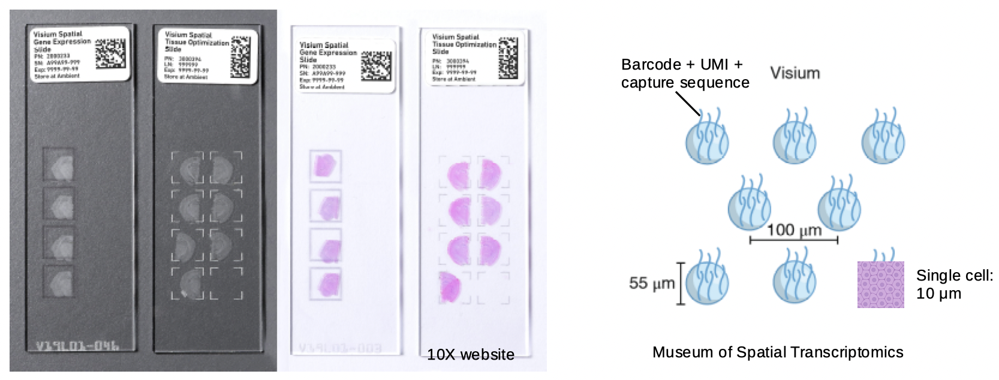

```{r, include = FALSE}
knitr::opts_chunk$set(
  collapse = TRUE,
  comment = "#>",
  eval = FALSE
)
```

## `SpatialFeatureExperiment`
`SpatialFeatureExperiment` (SFE) is a new [S4](http://adv-r.had.co.nz/S4.html) class built on top of [`SpatialExperiment`](https://bioconductor.org/packages/release/bioc/html/SpatialExperiment.html) (SPE). SFE incorporates geometries and geometric operations with the [`sf`](https://cran.r-project.org/web/packages/sf/index.html) package. Examples of supported geometries are Visium spots represented with polygons corresponding to their size, cell or nuclei segmentation polygons, tissue boundary polygons, pathologist annotation of histological regions, and transcript spots of genes. Using `sf`, `SpatialFeatureExperiment` leverages the GEOS C++ library underlying `sf` for geometry operations, including algorithms for for determining whether geometries intersect, finding intersection geometries, buffering geometries with margins, etc. A schematic of the SFE object is shown below:

```{r, echo=FALSE, out.width = "100%",  fig.alt="SpatialFeatureExperiment expands on SpatialExperiment by adding column, row, and annotation geometries and spatial graphs. This is explained in detail in the following paragraphs."}
knitr::include_graphics("sfe_schematics.png")
```

Below is a list of SFE features that extend the SPE object:

* `colGeometries` are `sf` data frames associated with the entities that correspond to columns of the gene count matrix, such as Visium spots or cells. The geometries in the `sf` data frames can be Visium spot centroids, Visium spot polygons, or for datasets with single cell resolution, cell or nuclei segmentations. Multiple `colGeometries` can be stored in the same SFE object, such as one for cell segmentation and another for nuclei segmentation. There can be non-spatial, attribute columns in a `colGeometry` rather than `colData`, because the `sf` class allows users to specify how attributes relate to geometries, such as "constant", "aggregate", and "identity". See the `agr` argument of the [`st_sf` documentation](https://r-spatial.github.io/sf/reference/sf.html).
* `colGraphs` are spatial neighborhood graphs of cells or spots. The graphs have class `listw` (`spdep` package), and the `colPairs` of `SingleCellExperiment` was not used so no conversion is necessary to use the numerous spatial dependency functions from `spdep`, such as those for Moran's I, Geary's C, Getis-Ord Gi*, LOSH, etc. Conversion is also not needed for other classical spatial statistics packages such as `spatialreg` and `adespatial`.
* `rowGeometries` are similar to `colGeometries`, but support entities that correspond to rows of the gene count matrix, such as genes. A potential use case is to store transcript spots for each gene in smFISH or in situ sequencing based datasets.
* `rowGraphs` are similar to `colGraphs`. A potential use case may be spatial colocalization of transcripts of different genes.
* `annotGeometries` are `sf` data frames associated with the dataset but not directly with the gene count matrix, such as tissue boundaries, histological regions, cell or nuclei segmentation in Visium datasets, and etc. These geometries are stored in this object to facilitate plotting and using `sf` for operations such as to find the number of nuclei in each Visium spot and which histological regions each Visium spot intersects. Unlike `colGeometries` and `rowGeometries`, the number of rows in the `sf` data frames in `annotGeometries` is not constrained by the dimension of the gene count matrix and can be arbitrary.
* `annotGraphs` are similar to `colGraphs` and `rowGraphs`, but are for entities not directly associated with the gene count matrix, such as spatial neighborhood graphs for nuclei in Visium datasets, or other objects like myofibers. These graphs are relevant to `spdep` analyses of attributes of these geometries such as spatial autocorrelation in morphological metrics of myofibers and nuclei. With geometry operations with `sf`, these attributes and results of analyses of these attributes (e.g. spatial regions defined by the attributes) may be related back to gene expression.
* `localResults` are similar to [`reducedDims` in `SingleCellExperiment`](https://bioconductor.org/packages/release/bioc/vignettes/SingleCellExperiment/inst/doc/intro.html#3_Adding_low-dimensional_representations), but stores results from univariate and bivariate local spatial analysis results, such as from [`localmoran`](https://r-spatial.github.io/spdep/reference/localmoran.html), [Getis-Ord Gi\*](https://r-spatial.github.io/spdep/reference/localG.html), and [local spatial heteroscedasticity (LOSH)](https://r-spatial.github.io/spdep/reference/LOSH.html). Unlike in `reducedDims`, for each type of results (type is the type of analysis such as Getis-Ord Gi\*), each feature (e.g. gene) or pair of features for which the analysis is performed has its own results. The local spatial analyses can also be performed for attributes of `colGeometries` and `annotGeometries` in addition to gene expression and `colData`. Results of multivariate spatial analysis such as [MULTISPATI PCA](https://cran.r-project.org/web/packages/adespatial/vignettes/tutorial.html#multispati-analysis) can be stored in `reducedDims`.

## `Voyager`

```{r, echo=FALSE, out.width = "100%", fig.alt="Schematics of the Voyager project"}
knitr::include_graphics("voyager.png")
```

## 10X Visium
As Visium from 10X Genomics is currently the most popular spatial transcriptomics technology, this workshop uses a Visium dataset.

```{r, echo = FALSE, fig.alt='Bar chart showing the number of institutions using each spatial transcriptomics data collection method. Only methods used by at least 3 different institutions are shown. The bars are colored by category of the methods. 10X Visium which is based on sequence barcoding is used by almost 200 institutions. Following Visium are GeoMX DSP and GeoMX WTA which are "regions of interest" (ROI) methods, along with 2016 ST, MERFISH, and some other ROI selection methods.'}
knitr::include_graphics("https://pachterlab.github.io/LP_2021/04-current_files/figure-html/n-insts-1.png")
```

In Visium, capture sequences with spot barcode, unique molecule identifier (UMI), and polyT to capture poly-adenylated mRNAs are printed in a hexagonal array on a glass slide. Each spot barcode has a known location, and the spots are 55 $\mu m$ in diameter and 100 $\mu m$ apart center to center. As the spots are much larger than most types of cells, Visium does not have single cell resolution. Tissue is mounted on each of the 4 capture areas on the slide, and each capture area has 4992 spots. The spots capture the transcripts from the tissue, which are then reverse transcribed, amplified, and sequenced.

```{r, echo = FALSE, fig.alt="Intro to Visium, described in the previous paragraph"}

```

Space Ranger is the official software to align the sequencing reads to the genome and quantify the UMIs in each spot for each gene. Spatial Ranger also takes in a histology image of the capture area, with which it determines which spots are in tissue. The user can also manually determine which spots are in tissue in the Loupe Browser.

# Part 1: The SFE class
```{r}
library(SpatialFeatureExperiment)
library(SFEData)
```

## Create an SFE object

10x Genomics Space Ranger output from a Visium experiment can be read in a similar manner as in `SpatialExperiment`; the `SpatialFeatureExperiment` SFE object has the `spotPoly` column geometry for the spot polygons. If the filtered matrix (i.e. only spots in the tissue) is read in, then a column graph called `visium` will also be present for the spatial neighborhood graph of the Visium spots on the tissue. The graph is not computed if all spots are read in regardless of whether they are on tissue.

```{r}
dir <- system.file("extdata", package = "SpatialFeatureExperiment")
sample_ids <- c("sample01", "sample02")
(samples <- file.path(dir, sample_ids))
```

The results for each tissue capture should be in the `outs` directory under the sample directory. Inside the `outs` directory, these directories may be present: `raw_reature_bc_matrix` has the unfiltered gene count matrix, `filtered_feature_bc_matrix` has the gene count matrix for spots in tissue, and `spatial` has the spatial information. The matrix directories contain the matrices in MTX format as sparse matrices. Space Ranger also outputs the matrices as h5 files, which are read into R in a similar way as MTX.

```{r}
list.files(file.path(samples[1], "outs"))
```

Inside the matrix directory:
```{r}
list.files(file.path(samples[1], "outs", "filtered_feature_bc_matrix"))
```

Inside the `spatial` directory:

```{r}
list.files(file.path(samples[1], "outs", "spatial"))
```

`tissue_lowres_image.png` is a low resolution image of the tissue. Not all Visium datasets have all the files here. The `barcode_fluorescence_intensity.csv` file is only present in datasets with fluorescent imaging rather than bright field H&E. 

```{r}
(sfe3 <- read10xVisiumSFE(samples, sample_id = sample_ids, type = "sparse", 
                          data = "filtered"))
```

Space Ranger output includes the gene count matrix, spot coordinates, and spot diameter. The Space Ranger output does NOT include nuclei segmentation or pathologist annotation of histological regions. Extra image processing, such as with ImageJ and QuPath, are required for those geometries.

See [this vignette](https://pachterlab.github.io/voyager/articles/create_sfe.html) on creating SFE objects from scratch and for other spatial trancriptomics technologies.

## Operations of SFE objects
User interfaces to get or set the geometries and spatial graphs emulate those of `reducedDims` and `row/colPairs` in `SingleCellExperiment`. Column and row geometries also emulate `reducedDims` in internal implementation, while annotation geometries and spatial graphs differ. Operations on SFE objects are demonstrated on a small toy dataset (you may need to answer a prompt in the R console when downloading the dataset):
```{r}
(sfe <- McKellarMuscleData(dataset = "small"))
```

### Column geometries
Column geometries or `colGeometries` are the geometries that correspond to columns of the gene count matrix, such as Visium spots and cells in datasets from a single cell resolution technology. Each SFE object can have multiple column geometries. For example, in a dataset with single cell resolution, whole cell segmentation and nuclei segmentation are two different `colGeometries`. However, for Visium, the spot polygons are the only `colGeometry` obviously relevant, though users can add other geometries such as results of geometric operations on the spot polygons. The different geometries can be get or set with their names, and "spotPoly" is the standard name for Visium spot polygons.
```{r}
# Get Visium spot polygons
(spots <- colGeometry(sfe, "spotPoly"))
```

```{r}
plot(st_geometry(spots))
```

```{r}
# Set colGeometry
colGeometry(sfe, "spotPoly") <- spots
```

To see which `colGeometries` are present in the SFE object:
```{r}
colGeometryNames(sfe)
```

There are shorthands for some specific column or row geometries. For example, `spotPoly(sfe)` is equivalent to `colGeometry(sfe, "spotPoly")` shown above. 

```{r}
# Getter
(spots <- spotPoly(sfe))
```

```{r}
# Setter
spotPoly(sfe) <- spots
```

### Annotation
Annotation geometries can be get or set with `annotGeometry()`. In column or row geometries, the number of rows of the `sf` data frame (i.e. the number of geometries in the data frame) is constrained by the number of rows or columns of the gene count matrix respectively, because just like `rowData` and `colData`, each row of a `rowGeometry` or `colGeometry` `sf` data frame must correspond to a row or column of the gene count matrix respectively. In contrast, an `annotGeometry` `sf` data frame can have any dimension, not constrained by the dimension of the gene count matrix. 

```{r}
# Getter, by name or index
(tb <- annotGeometry(sfe, "tissueBoundary"))
```

```{r}
plot(st_geometry(tb))
```

```{r}
# Setter, by name or index
annotGeometry(sfe, "tissueBoundary") <- tb
```

See which `annotGeometries` are present in the SFE object:
```{r}
annotGeometryNames(sfe)
```

There are shorthands for specific annotation geometries. For example, `tissueBoundary(sfe)` is equivalent to `annotGeometry(sfe, "tissueBoundary")`. `cellSeg()` (cell segmentation) and `nucSeg()` (nuclei segmentation) would first query `colGeometries` (for single cell, single molecule technologies, equivalent to `colGeometry(sfe, "cellSeg")` or `colGeometry(sfe, "nucSeg")`), and if not found, they will query `annotGeometries` (for array capture and microdissection technologies, equivalent to `annotGeometry(sfe, "cellSeg")` or `annotGeometry(sfe, "nucSeg")`). 

```{r}
# Getter
(tb <- tissueBoundary(sfe))
```

```{r}
# Setter
tissueBoundary(sfe) <- tb
```

### Spatial graphs
The spatial neighborhood graphs for Visium spots are stored in the `colGraphs` field, which has similar user interface as `colGeometries`. SFE also wraps all methods to find the spatial neighborhood graph implemented in the `spdep` package, and triangulation is used here as demonstration.
```{r}
(g <- findSpatialNeighbors(sfe, MARGIN = 2, method = "tri2nb"))
```

```{r}
plot(g, coords = spatialCoords(sfe))
```

```{r}
# Set graph by name
colGraph(sfe, "graph1") <- g
```

```{r}
# Get graph by name
(g <- colGraph(sfe, "graph1"))
```

For Visium, spatial neighborhood graph of the hexagonal grid can be found with the known locations of the barcodes. One SFE object can have multiple `colGraphs`.
```{r}
colGraph(sfe, "visium") <- findVisiumGraph(sfe)
```

```{r}
plot(colGraph(sfe, "visium"), coords = spatialCoords(sfe))
```

Which graphs are present in this SFE object?
```{r}
colGraphNames(sfe)
```

While this workshop only works with one sample, i.e. tissue section, operations on multiple samples is discussed in [the vignette of the SFE package](https://pachterlab.github.io/SpatialFeatureExperiment/articles/SFE.html#multiple-samples).

```{r}
sessionInfo()
```

